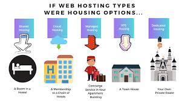

# Protocol Stack:

    In computer networking, a protocol stack refers to a set of communication
    protocols that are used to establish communication between devices or
    applications in a network. These protocols are arranged in a layered
    architecture, with each layer performing a specific function.

    The most widely used protocol stack in web development is the TCP/IP
    (Transmission Control Protocol/Internet Protocol) protocol stack. It
    consists of four layers: the application layer, transport layer, network
    layer, and data link layer. Each layer is responsible for a different
    aspect of communication, such as data formatting, data transmission,
    addressing, and error detection.

- Application Layer: The application layer is responsible for interacting with
  applications, such as web browsers or email clients.
- Transport Layer: The transport layer provides reliable data transmission and flow control between applications.
- Network Layer: The network layer handles the routing of data packets between
  different networks.
- Data Link: The data link layer defines the format of the data transmitted over
  the physical network.

  ***

  ## Types of Web Servers

  ### Web servers are software applications that are responsible for delivering web content to client devices, such as web browsers. There are different types of web servers, including:

- Apache HTTP Server
- Nginx
- Microsoft Internet Information Services (IIS)
- Lighttpd:
- Node.js:

### Functionality and Performance:

Each web server has its own strengths and weaknesses in terms of functionality and performance. Apache is known for its stability and flexibility, while Nginx is known for its speed and efficiency. IIS is designed to integrate seamlessly with other Microsoft products, while Lighttpd is a lightweight option for handling large amounts of traffic. Node.js is ideal for applications that require real-time communication between the server and the client.

The performance of a web server depends on a variety of factors, such as the hardware it is running on, the amount of traffic it is handling, and the software configuration. However, in general, Nginx and Lighttpd are known for their speed and efficiency, while Apache and IIS are known for their stability and flexibility.

---

## What is Web Hosting?

Web hosting is a service that allows individuals and organizations to make their websites accessible on the internet. A web hosting provider is a company that provides the technology and infrastructure needed to store and serve website content to visitors.

### Types of Hosting Services:

- Shared Hosting
- Virtual Private Server (VPS) Hosting
- Dedicated Hosting
- Cloud Hosting
- Managed Hosting

Each type of hosting service has its own advantages and limitations, and the choice of hosting service depends on the specific needs of the website or business. Factors to consider include the level of performance, security, customization, scalability, and technical expertise required.

---

## What is Scaling?

Scaling refers to the process of increasing the capacity of a system, such as a web application, to handle more traffic, users, and data. Scaling is important for web applications to ensure they can handle increasing levels of demand and maintain their performance and availability.

### Why is Scaling Important for Web Applications?

Web applications can experience sudden spikes in traffic due to factors such as promotions, seasonal events, or viral content. Without scaling, web applications can become overwhelmed and slow down, leading to a poor user experience and potential loss of revenue. Scaling ensures that web applications can handle high levels of traffic and provide a fast and reliable user experience.

### There are two main types of scaling: vertical scaling and horizontal scaling.

- Vertical scaling, also known as scaling up, involves increasing the capacity of a single server or machine by adding more resources such as CPU, RAM, or storage. This is typically done by upgrading the hardware of the server or machine. Vertical scaling is a good option for small to medium-sized applications that require occasional bursts of traffic.
- Horizontal scaling, also known as scaling out, involves adding more servers or machines to distribute the load and increase the capacity of the system. This is typically done by setting up a cluster of servers or using cloud-based services. Horizontal scaling is a good option for large applications that require consistent high levels of traffic.

---

## What is SEO?

SEO, or Search Engine Optimization, is the practice of optimizing websites and web pages to rank higher in search engine results pages (SERPs) for relevant keywords and phrases. The goal of SEO is to increase the visibility and traffic of a website by improving its search engine ranking.

### How can Web Developers Optimize Their Websites for Better Search Engine Rankings?

Web developers can optimize their websites for better search engine rankings in the following ways:

- Keyword research involves identifying relevant keywords and phrases that potential customers use to find products or services similar to those offered by the website. This helps web developers to optimize website content and meta tags with the most relevant keywords, increasing the chances of ranking higher in search engine results pages for those keywords.
- On-page optimization involves optimizing individual web pages to improve their search engine rankings. This includes optimizing the page title, meta description, header tags, and content with relevant keywords and phrases. On-page optimization also includes ensuring that web pages are mobile-friendly, have fast loading times, and have a clear structure that is easy to navigate.
- Off-page optimization involves optimizing external factors that influence the search engine ranking of a website, such as backlinks and social media signals. Backlinks are links from other websites that point to a website, and social media signals refer to the level of engagement and shares that a website receives on social media platforms.
- Technical optimization involves optimizing the technical aspects of a website, such as its site architecture, page speed, and security. This includes optimizing website code and ensuring that the website is secure and follows best practices for website performance and accessibility.
- Creating high-quality, relevant, and engaging content is essential for improving the search engine ranking of a website. Web developers should focus on creating content that provides value to their target audience and is optimized with relevant keywords and phrases.

### Conclusion:

- SEO is an important aspect of website development that can help to improve the visibility and traffic of a website by improving its search engine ranking. Web developers can optimize their websites for better search engine rankings by conducting keyword research, on-page optimization, off-page optimization, technical optimization, and content creation. By following best practices for SEO, web developers can ensure that their websites are visible to potential customers and generate more traffic and revenue.
